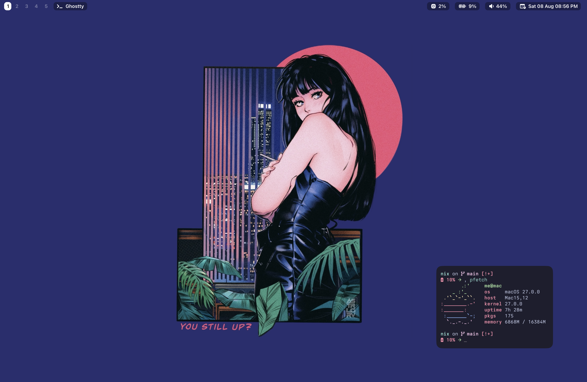
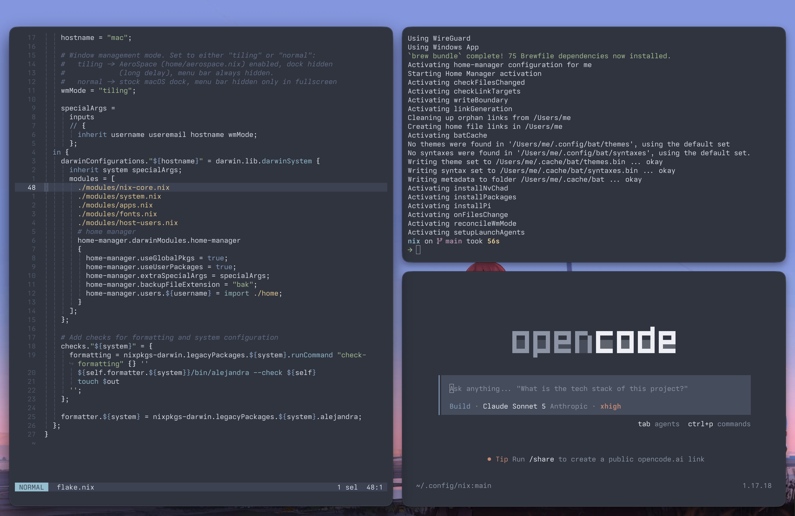

# nix

Personal macOS system configuration using [nix-darwin](https://github.com/lnl7/nix-darwin) + [home-manager](https://github.com/nix-community/home-manager), managed as a flake.




## Usage

```sh
darwin-rebuild switch --flake ~/.config/nix
```

(aliased to `dr` in fish, see `home/shell.nix`)

## Structure

```
flake.nix          entry point (inputs, username/hostname, wmMode, darwinConfiguration)
modules/           system-level (nix-darwin) config
  nix-core.nix        nix settings (flakes, gc, auto-optimise)
  system.nix          macOS defaults & tweaks
  apps.nix            homebrew (casks/brews/mas apps)
  fonts.nix           custom font derivations
  host-users.nix      hostname + user account
home/               user-level (home-manager) config, one file per tool
  <tool>.nix          wires up home.file/home.activation for <tool>
  <tool>/             the actual config files <tool>.nix deploys (dotfiles,
                       scripts, patches) - kept out of the .nix so they read
                       and diff like normal config, not embedded strings
```

`wmMode`, set at the top of `flake.nix`, gates most of the window-management-related config: `"tiling"` (AeroSpace enabled, dock/menu bar hidden) or `"normal"` (stock macOS dock/menu bar, nothing tiling-related runs). `home/wm-mode.nix` reconciles the actual running processes to match it on every activation.

## macOS tweaks applied

All set declaratively in `modules/system.nix`:

- **Trackpad**: tap to click off, three-finger drag on, three-finger swipe between pages; Mission Control / App Exposé / full-screen swipe / Launchpad & Show Desktop pinch gestures all off (AeroSpace replaces them)
- **Keyboard**: fast key repeat, no auto-capitalize/dash/period/quote substitution, no autocorrect
- **Windows**: no window animations, drag windows with ctrl+cmd (anywhere in the window), title bar double-click does nothing, macOS window tiling (edge drag / opt-drag / margins) disabled, dragging to top of screen doesn't trigger Mission Control
- **Display**: built-in display pinned to "More Space" scaling via `displayplacer` (activation script)
- **Dock**: auto-hide (no delay), bottom, no rearranging by most-recently-used
- **Menu bar**: analog clock
- **Finder**: show all file extensions, path bar + status bar, list view by default, show external/USB/network drives on desktop
- **Desktop**: icons hidden (Stage Manager style)
- **Screenshots**: saved as PNG to `~/Pictures/Screenshots`
- **Screensaver**: require password immediately on wake
- **Touch ID for sudo** enabled
- **Dark mode**, silent system sounds, no Apple ad personalization
- Default shells: fish (login) and zsh, both registered system-wide

## Apps (Homebrew, declared in `modules/apps.nix`)

- **Browsers**: Brave, Firefox, Chrome, Helium, Tor, Dia
- **Development**: VS Code, Zed, Obsidian, JetBrains Toolbox, OrbStack, Postman, Sequel Ace, TablePlus, Superset, Supacode, opencode (via `anomalyco/tap`), Claude Code, Codex, Copilot CLI
- **Communication**: Discord, Telegram, Signal, nchat (via `d99kris/nchat`)
- **Productivity & utilities**: 1Password (+ CLI), Raycast, ChatGPT, Blip, Free Download Manager, Tailscale, NordVPN, Gloomberb, Itsycal, Wispr Flow, AnyDesk
- **Media & design**: GIMP, IINA, OBS, Spotify
- **System & other**: AeroSpace (tiling WM), Ghostty, Nerd Fonts, Transmission, UTM, Steam, Xonotic
- **Mac App Store**: WhatsApp, WireGuard, Windows App

Homebrew's `openjdk` formula is keg-only, so `modules/system.nix` symlinks it into `/Library/Java/JavaVirtualMachines` via an activation script so `/usr/libexec/java_home` and GUI apps can find it.

## Terminal / shell

- Shell: [fish](home/shell.nix) with [starship](home/starship.nix) prompt, Homebrew on PATH
- Terminal: [Ghostty](home/ghostty.nix) — Tokyo Night, Iosevka Nerd Font Mono, no "Last login" banner (`~/.hushlogin`)
- CLI tools ([home/core.nix](home/core.nix)): ripgrep, fzf, eza, zoxide, bat (Tokyo Night theme), yazi, jq, gh, htop, fastfetch, atuin (Tokyo Night theme), and language servers/toolchains for Go, Python, Node, Lua, Java

## Editors

- [Helix](home/helix.nix) — primary editor, Tokyo Night theme (transparent background), LSPs for Nix/Go/Python/Lua/TS/Java
- [Neovim](home/neovim.nix) — NvChad-based config, Tokyo Night theme (transparent), set as `$EDITOR`

## Window management

- [AeroSpace](home/aerospace.nix) — the tiling window manager, vim-style keybindings (`alt+hjkl`) defined in its own config, `alt-t` opens a new Ghostty window, no private APIs

Only runs when `wmMode == "tiling"`.

## Git

Configured in [home/git.nix](home/git.nix): `main` as default branch, autosetup remote on push, rebase on pull, short aliases (`gs`, `ga`, `gc`, `gp`, `gl`, ...). Commits are SSH-signed with a key stored in 1Password (`op-ssh-sign`).
